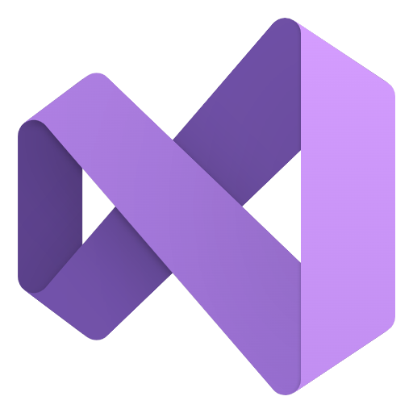

<!--
**DivineBytes/DivineBytes** is a ✨ _special_ ✨ repository because its `README.md` (this file) appears on your GitHub profile.

Here are some ideas to get you started:

- 🔭 I’m currently working on ...
- 🌱 I’m currently learning ...
- 👯 I’m looking to collaborate on ...
- 🤔 I’m looking for help with ...
- 💬 Ask me about ...
- 📫 How to reach me: ...
- 😄 Pronouns: ...
- ⚡ Fun fact: ...
-->

<h1 align="center">Hello, world! 👋</h1>

Welcome! To my software repository.

<h1 align="center">Programming Languages 📜</h1>

  

    
    
    
    
    
    
    
    
  

  <h1 align="center">Software 💖</h1>

  

    
    
  

